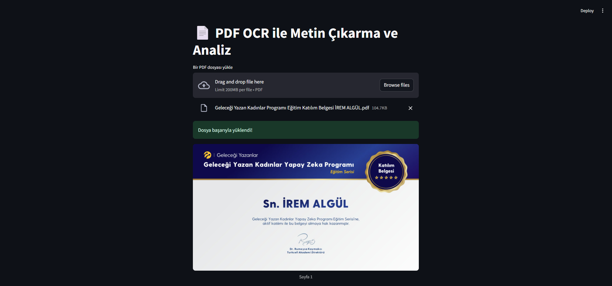
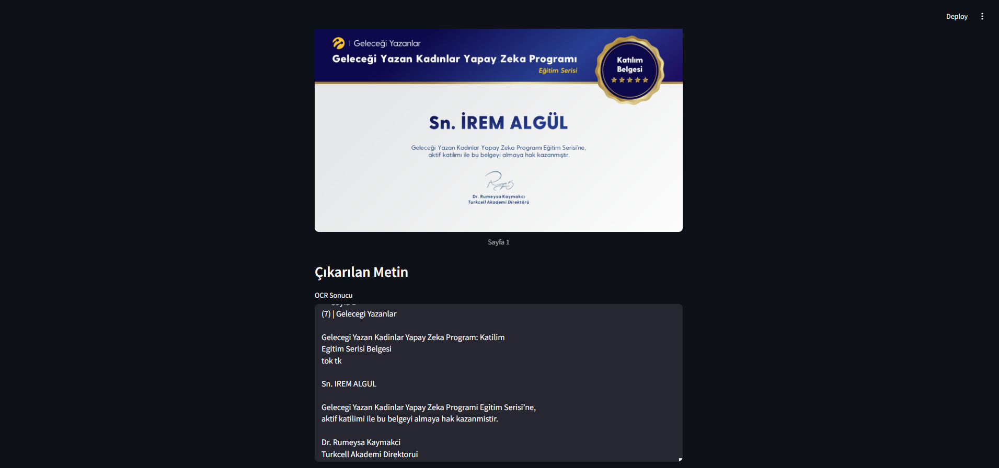

# PDF OCR Metin Çıkarma Uygulaması

Bu Streamlit uygulaması, PDF dosyalarından OCR (Optical Character Recognition) kullanarak metin çıkarma işlemi yapar.

## Özellikler

- PDF dosyası yükleme
- Otomatik OCR işlemi
- Sayfa görüntüleme
- Çıkarılan metni görüntüleme ve kopyalama
  
## Örnek




## Kurulum

1. Projeyi klonlayın:
```bash
git clone https://github.com/KULLANICI_ADINIZ/ocr_streamlit.git
cd ocr_streamlit
```

2. Gerekli bağımlılıkları yükleyin:
```bash
pip install -r requirements.txt
```

3. Tesseract OCR'ı yükleyin:
   - Windows için: https://github.com/UB-Mannheim/tesseract/wiki
   - Linux için: `sudo apt-get install tesseract-ocr`
   - macOS için: `brew install tesseract`

4. Poppler'ı yükleyin:
   - Windows için: https://github.com/oschwartz10612/poppler-windows/releases/
   - Linux için: `sudo apt-get install poppler-utils`
   - macOS için: `brew install poppler`

## Kullanım

Uygulamayı başlatmak için:

```bash
streamlit run app.py
```

Tarayıcınızda otomatik olarak açılacak olan arayüzde:
1. "Bir PDF dosyası yükle" butonuna tıklayın
2. PDF dosyanızı seçin
3. OCR işlemi otomatik olarak başlayacak ve sonuçlar görüntülenecektir

## Gereksinimler

- Python 3.7+
- Streamlit
- pdf2image
- pytesseract
- Pillow
- Tesseract OCR
- Poppler

## Lisans

MIT 
